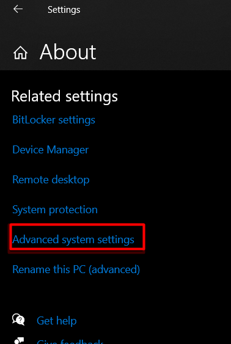

# Python Installation on Windows

This guide aims to demonstrate the installation process of python on windows system using different techniques.


## Using Anaconda
Download latest version of anaconda from official website using this [link](https://www.anaconda.com/products/individual).

The most recent versions supports *Windows 10* and later. However if you are operating on *Windows 7*, you may download one of the older versions like 2020 or 2019 from the [archives](https://repo.anaconda.com/archive/).

## Using *Python* executables
You can download the latest version of python from their official [website](https://www.python.org/downloads/).

In order to run the python from terminal, you can open 'cmd' on windows and run following command.

```console
python
```

To install a package using pip, simply use pip install command as follow:

```console
pip install [your-package-name]
```

### Debuging the installation errors.
A commonly occuring error in installation of *Python* using executables is 
```console
python is not recognized as an internal or external command
```
One of common reason for this error is due to environment variable are not set properly. To fix this issue open the *advanced system settings* as follow and add a new path to system variables pointing to the installation location of Python.





### Debugging the pip errors.
In case of older python installations, pip is installed by default. therefore, you may need to install it manually using [get-pip.py](https://bootstrap.pypa.io/get-pip.py). 
* Go to the above website and copy-paste its content to a .txt file.
* Save the .txt file as "get-pip.py".
* Open cmd and navigate to the "get-pip.py" folder using `cd` command. 
* Then run the following command.
```script
python get-pip.py
```
This would install pip for the python installation.
